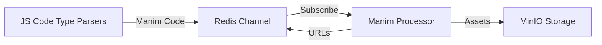

# ClassZero Kaari: Comprehensive Product & Technical Report

---

## Table of Contents

1. Executive Summary
2. Product Vision and Value Proposition
3. System Overview
4. Architecture Deep Dive
5. End-to-End Workflow Lifecycle
6. Backend Components
7. Frontend Product Logic (Non-UI)
8. Security and Compliance
9. Operations, Monitoring, and Maintenance
10. Scalability and Extensibility
11. Use Cases and Product Scenarios
12. Roadmap and Future Directions
13. Appendix: Technology Stack

---

## 1. Executive Summary

ClassZero Kaari is an advanced, AI-powered, automated platform for generating, rendering, and delivering mathematical and educational presentations. It transforms natural language queries into high-quality, animated slides and persistent knowledge assets. By combining workflow automation, distributed rendering, and seamless integration between AI and mathematical animation, Kaari delivers a revolutionary product for educators, content creators, and organizations.

Kaari is more than a tool—it is a full-featured, extensible system that automates the entire lifecycle from content conception to delivery, with a focus on reliability, scalability, and ease of integration.

---

## 2. Product Vision and Value Proposition

### Vision
ClassZero Kaari envisions a world where the creation of complex, visually engaging educational content is as simple as asking a question. By leveraging AI and automation, Kaari empowers users to focus on ideas, not implementation.

### Value Proposition
- **Radically Simplified Content Creation:** Generate presentations or slides by describing your needs in plain language.
- **AI-Driven Personalization:** Kaari adapts prompts and uses curated examples from its knowledge base for tailored content.
- **Automated High-Quality Rendering:** Mathematical and conceptual content is rendered into professional-grade videos and images using Manim.
- **Seamless Workflow Orchestration:**

  At the heart of ClassZero Kaari lies a meticulously engineered orchestration layer that ensures every step of the content generation pipeline—from the moment a user submits a query to the instant a rendered asset is delivered—is fully automated, observable, and robust against failures. This seamless workflow orchestration is not merely a convenience; it is a foundational design principle that enables the platform to deliver on its promises of speed, reliability, and adaptability, while also setting it apart from traditional, manually operated or partially automated solutions.

  ### Architectural Rationale

  The rationale for investing in such a comprehensive orchestration system stems from the inherent complexity and interdependence of the tasks involved in transforming a natural language query into a polished, animated educational asset. Each stage—AI prompt engineering, context enrichment, code generation, distributed rendering, asset storage, and metadata management—requires precise coordination, state management, and error handling. By employing a workflow automation engine (n8n), message brokers (Redis), and containerized microservices, Kaari achieves a level of orchestration that is both fine-grained and scalable.

  ### Technical Mechanisms

  Kaari’s workflow orchestration is implemented using n8n, an open-source workflow automation tool renowned for its flexibility and extensibility. n8n allows developers to define workflows as directed graphs, where each node represents a discrete operation (e.g., database query, HTTP request, message publication, or custom script execution). These workflows are triggered by events—such as the arrival of a new user query, the completion of an AI task, or the successful rendering of an asset—and can branch, loop, or execute in parallel as required.

  The orchestration layer leverages Redis for asynchronous message passing and pub/sub semantics, ensuring that each microservice operates independently yet remains tightly integrated into the broader pipeline. For example, once the AI model produces a JSON representation of a slide, this artifact is published to a Redis channel. Downstream services, such as code parsers and the Manim rendering engine, subscribe to these channels and react to new messages in real time.

  ### Workflow Examples

  Consider the typical journey of a user-initiated content request:

  1. **User Query Submission:** The frontend captures a user’s request for a new slide or presentation. This is routed through HAProxy to the n8n workflow engine.
  2. **Context Enrichment:** n8n orchestrates the retrieval of relevant examples and metadata from PostgreSQL, enriching the AI prompt with contextually appropriate material.
  3. **AI Invocation:** The workflow invokes the AI model, passing the user’s query and the enriched prompt. The AI returns a structured JSON object describing the desired slide.
  4. **Message Publication:** n8n publishes the JSON to a Redis channel dedicated to slide generation tasks.
  5. **Code Generation:** JavaScript-based parsers, listening on the Redis channel, consume the JSON and generate Manim-compatible Python code.
  6. **Distributed Rendering:** The code is published to another Redis channel, where one or more Manim Processor instances pick it up and render the final assets.
  7. **Asset Storage and Notification:** Rendered assets are uploaded to MinIO, and their URLs are published back to Redis.
  8. **Database Update:** n8n captures the asset URLs and updates the PostgreSQL database, ensuring all metadata is persistently stored.
  9. **Frontend Notification:** The frontend queries the database for asset links and presents the finished product to the user.

  This entire process is automated, with each handoff and operation managed by the orchestration layer. Users experience near real-time feedback and can trust that their requests will be handled efficiently, even under heavy load.

  ### Error Handling and Recovery

  Robust error handling is a cornerstone of Kaari’s orchestration design. Each workflow node can be configured with retry logic, fallback paths, and notification triggers. For example, if the AI service fails to respond within a set timeout, the workflow can automatically retry the request, escalate the issue to an administrator, or revert to a cached response. Similarly, if a rendering job fails, the system can re-queue the task or attempt to render on a different processor instance.

  All errors and exceptions are logged centrally, providing administrators with a comprehensive view of system health and facilitating rapid troubleshooting. The orchestration layer also supports transactional operations, ensuring that partial failures do not result in inconsistent states or data loss.

  ### Orchestration Patterns

  Kaari employs several advanced orchestration patterns to maximize efficiency and reliability:

  - **Event-Driven Processing:** Workflows are triggered by events, allowing the system to respond dynamically to user actions and service outputs.
  - **Parallelism and Concurrency:** Tasks such as batch slide generation or multi-slide rendering are executed in parallel, leveraging the scalability of containerized microservices.
  - **Idempotency and Deduplication:** Workflows are designed to be idempotent, ensuring that repeated events (e.g., duplicate messages) do not result in redundant processing or inconsistent states.
  - **Saga Pattern:** For multi-step operations that span multiple services (e.g., rendering and asset storage), Kaari implements compensation logic to roll back or correct partial failures.

  ### Scalability and Reliability

  The orchestration layer is architected for horizontal scalability. Stateless microservices can be replicated to handle increased load, while Redis ensures that messages are distributed efficiently across all instances. n8n workflows can be scaled out and managed via Docker Compose or Kubernetes, further enhancing the platform’s ability to handle enterprise-scale workloads.

  Reliability is ensured through rigorous monitoring, health checks, and automatic failover mechanisms. The system continuously tracks the status of each workflow, service, and message queue, enabling proactive detection and resolution of issues. In the event of a service outage, tasks are automatically re-queued and retried, minimizing the risk of data loss or user disruption.

  ### Differentiation from Other Solutions

  Unlike many traditional content generation platforms—which rely on manual intervention, brittle scripts, or monolithic architectures—ClassZero Kaari’s seamless workflow orchestration delivers a level of automation, transparency, and resilience that is unmatched in the industry. The platform’s modular design allows for rapid adaptation to new requirements, easy integration with third-party tools, and continuous improvement based on user feedback.

  By making every step of the process observable and automatable, Kaari empowers organizations to scale their content creation efforts without sacrificing quality or control. The result is a system that not only meets the demands of modern educational and professional environments but also anticipates future challenges and opportunities.

  In summary, Kaari’s seamless workflow orchestration is the engine that drives its innovation and success. It transforms complexity into simplicity, risk into reliability, and vision into reality—making it the platform of choice for forward-thinking educators, content creators, and organizations worldwide.
- **Persistent, Searchable Knowledge:**

  One of the most transformative aspects of ClassZero Kaari is its unwavering commitment to persistent, searchable knowledge. Unlike ephemeral or siloed content generation tools, Kaari is architected from the ground up to ensure that every asset, every piece of metadata, and every interaction is durably recorded, richly annotated, and instantly accessible for future use. This persistent knowledge base is not just a technical convenience—it is a strategic enabler for cumulative learning, organizational memory, and data-driven decision-making.

  ### Architectural Approach

  At the core of Kaari’s knowledge management lies a robust PostgreSQL database, meticulously structured to capture the full lifecycle of content creation. Every slide, video, image, and supporting artifact generated by the system is registered in the database, along with comprehensive metadata such as creation timestamps, authorship, content type, tags, AI prompt lineage, and usage history. This schema is designed for extensibility, allowing new asset types, metadata fields, and relationships to be added as the platform evolves.

  The architecture ensures that data persistence is never an afterthought. Every workflow, from AI prompt generation to asset rendering and delivery, includes explicit steps for recording outcomes in the database. This guarantees that no asset is lost, no context is forgotten, and every result can be traced, audited, and reused.

  ### Technical Implementation

  Kaari leverages PostgreSQL’s advanced features—such as JSONB columns for flexible metadata, full-text search for rapid querying, and transactional integrity for reliable updates—to deliver a knowledge base that is both powerful and performant. Assets are stored in MinIO object storage, with their URLs and associated metadata recorded in PostgreSQL. This separation of binary data and metadata enables scalable storage while maintaining fast, structured access to all content.

  The system supports automated indexing, versioning, and deduplication of assets. For example, if a slide is regenerated with minor changes, both the original and revised versions are preserved, with clear lineage and timestamps. This enables users to track the evolution of content, revert to previous versions, or analyze trends over time.

  ### Data Modeling

  The data model is intentionally designed for flexibility and future-proofing. Key tables include:

  - `slides`: Stores metadata for each slide, including title, description, asset URLs, content type, and creation details.
  - `examples`: Contains curated examples used for AI prompt augmentation, linked to relevant slides and topics.
  - `users` (optional): Tracks user activity, permissions, and contribution history.
  - `tags` and `categories`: Enable rich classification and faceted search across all assets.
  - `audit_logs`: Record every significant event, from asset creation to user access and workflow execution.

  Relationships between tables are normalized to support complex queries, such as finding all slides related to a specific topic, all assets generated by a particular user, or all content created within a given timeframe.

  ### Search and Retrieval Strategies

  Kaari’s knowledge base is engineered for instant, intuitive search and retrieval. Full-text search indexes allow users and workflows to locate content by keyword, topic, or metadata field. Faceted search enables filtering by content type, creation date, author, or tag. Advanced queries can combine multiple criteria—such as “find all video slides about calculus created in the last month by Dr. Smith”—with sub-second response times.

  The platform also supports semantic search, leveraging AI to match user queries with relevant assets even when exact keywords are not present. This is particularly valuable in educational settings, where users may search for concepts, examples, or explanations using natural language.

  ### Analytics Capabilities

  Persistent storage unlocks a wealth of analytics possibilities. Administrators and educators can generate reports on content usage, identify popular topics, track learning outcomes, and measure engagement over time. The system can surface insights such as which slides are most frequently reused, which topics generate the most questions, or how AI-generated content evolves in response to user feedback.

  These analytics are not limited to passive reporting. Workflows can be configured to trigger actions based on data trends—for example, automatically updating outdated slides, flagging underused assets for review, or recommending new content based on emerging interests.

  ### Real-World Scenarios

  In practice, Kaari’s persistent knowledge base enables a range of transformative scenarios:

  - **Cumulative Learning:** As educators and learners interact with the platform, a rich repository of slides, examples, and explanations accumulates. This repository becomes a living knowledge base that grows in value over time, supporting both individual and institutional learning goals.
  - **Content Reuse and Adaptation:** Users can easily find and reuse existing assets, adapting them to new contexts or audiences. This reduces duplication of effort and ensures consistency across presentations.
  - **Auditability and Compliance:** Every asset and interaction is logged, enabling organizations to demonstrate compliance with educational standards, intellectual property policies, or regulatory requirements.
  - **Collaborative Content Development:** Teams can contribute, review, and refine content collaboratively, with full visibility into who made what changes and when.
  - **Personalized Recommendations:** The system can suggest relevant slides or examples based on user profiles, past activity, or current learning objectives.

  ### Differentiation from Other Solutions

  Many content generation tools treat persistence as an afterthought, offering only basic export or download options. In contrast, Kaari’s knowledge base is a first-class citizen, designed to support long-term value creation, organizational memory, and continuous improvement. The combination of rich metadata, advanced search, and analytics capabilities empowers users to not only create content, but to manage, curate, and leverage it strategically.

  By making knowledge persistent, searchable, and actionable, Kaari transforms content creation from a series of isolated transactions into a virtuous cycle of learning, reuse, and innovation. This approach not only increases efficiency and quality, but also positions organizations to adapt quickly to new challenges and opportunities in education and beyond.

---

## 3. System Overview

ClassZero Kaari is a next-generation, AI-powered, end-to-end platform designed to automate the creation, rendering, management, and delivery of mathematical and educational presentations. Its architecture is a showcase of modern software engineering principles, leveraging microservices, containerization, workflow automation, distributed processing, and robust data management to deliver a product that is both powerful and adaptable.

### 3.1 Purpose and Philosophy

At its core, Kaari is built to address the inefficiencies and limitations of traditional content creation tools. Manual slide creation is time-consuming, error-prone, and often results in inconsistent quality. Kaari’s vision is to enable users—educators, researchers, institutions, and content creators—to describe their intent in natural language and have the system handle the rest. This is achieved not only through advanced AI, but by orchestrating a suite of specialized services that work in harmony to deliver consistently high-quality results.

### 3.2 End-to-End Automation

Kaari’s automation is not superficial or limited to a single step; it spans the entire lifecycle:

- **User Query Intake:** Users submit requests in plain language, specifying the concept, proof, or visualization they need.
- **Contextual Enrichment:** The system augments user queries with relevant examples and metadata from its knowledge base.
- **AI-Driven Content Generation:** An AI model generates a structured, machine-readable representation of the desired slide.
- **Code Generation and Parsing:** Specialized parsers convert the AI output into executable code (e.g., Manim scripts for mathematical animations).
- **Distributed Rendering:** Rendering engines process the code, producing high-quality images and videos.
- **Persistent Storage:** All assets and metadata are stored in a robust, queryable database.
- **Presentation Delivery:** The frontend retrieves and assembles the assets for seamless user consumption.

### 3.3 Modular Microservices

Kaari’s architecture is modular by design. Each major function is encapsulated in a dedicated microservice, allowing for independent development, scaling, and maintenance. This modularity ensures that the system can evolve rapidly, incorporate new technologies, and adapt to changing requirements without major rewrites.

**Key Microservices:**

- **n8n Workflow Engine:** Orchestrates all backend logic and integrations.
- **Redis Broker:** Facilitates fast, asynchronous communication between services.
- **PostgreSQL Database:** Stores all persistent data with full ACID compliance.
- **Manim Processor:** Handles computationally intensive rendering tasks.
- **MinIO Storage:** Provides scalable, S3-compatible object storage for large assets.
- **HAProxy Load Balancer:** Routes and manages all incoming and internal traffic.
- **Frontend (Next.js/React):** Interfaces with users, presenting the results of automated workflows.

### 3.4 Containerization and Orchestration

Every service in Kaari is containerized using Docker, ensuring consistent environments from development to production. Docker Compose is used for orchestration, simplifying deployment and scaling. This approach enables rapid prototyping, easy upgrades, and robust isolation between services.

### 3.5 Security, Observability, and Control

Security is woven into every layer of the system, from encrypted communications and role-based access controls to audit logging and compliance tracking. Observability is achieved through centralized logging, real-time monitoring, and health checks, allowing administrators to maintain operational excellence and quickly respond to issues.

### 3.6 Open Source and Local Control

Kaari is open source, giving organizations the freedom to deploy, extend, and audit the platform as needed. This transparency and control are critical for educational institutions, research organizations, and enterprises with strict compliance or data residency requirements.

### 3.7 Differentiation and Impact

What sets Kaari apart is the seamless integration of AI, automation, and persistent knowledge management. Unlike traditional tools that require manual effort at every step, Kaari automates the entire process, enabling users to focus on pedagogy and creativity rather than technical implementation. The result is higher quality, faster turnaround, and a continuously growing knowledge base that benefits all users.

---

## 4. Architecture Deep Dive

The architecture of ClassZero Kaari is a masterclass in modern distributed systems design. It is engineered to be scalable, resilient, extensible, and observable, with each component playing a well-defined role in the overall workflow.

### 4.1 High-Level Architecture

The system is composed of loosely coupled microservices, each responsible for a specific domain. These services communicate via asynchronous message passing and are orchestrated by a workflow engine that ensures consistency, reliability, and traceability.

**Core Components:**
- **Frontend (Next.js/React):** The user-facing layer for query submission, result visualization, and asset management.
- **HAProxy:** Serves as the entry point, load balancing and routing requests to the appropriate backend services.
- **n8n Workflow Engine:** The brain of the system, orchestrating all backend processes, integrating with AI, databases, and rendering engines.
- **Redis:** Provides fast, reliable message brokering for asynchronous communication and decoupling of services.
- **JavaScript Code Parsers:** Transform AI-generated JSON into executable Manim code.
- **Manim Processor (Python):** Renders high-quality videos and images from code.
- **MinIO:** Stores all rendered assets in a scalable, S3-compatible object store.
- **PostgreSQL:** Maintains all metadata, asset links, user activity, and audit logs.

#### 4.1.1 Architecture Diagram

```mermaid
graph TD
    User[User]
    Frontend[Frontend]
    HAProxy[HAProxy]
    n8n1[n8n (AI Prompt)]
    AI[AI Model]
    n8n2[n8n (Slide Workflow)]
    Redis[Redis]
    JSParser[JS Parsers]
    ManimProc[Manim Processor]
    MinIO[MinIO]
    PostgreSQL[PostgreSQL]

    User --> Frontend
    Frontend --> HAProxy
    HAProxy --> n8n1
    n8n1 --> AI
    AI --> n8n2
    n8n2 --> Redis
    Redis --> JSParser
    JSParser --> Redis
    Redis --> ManimProc
    ManimProc --> MinIO
    ManimProc --> Redis
    Redis --> n8n2
    n8n2 --> PostgreSQL
    Frontend --> PostgreSQL
```

### 4.2 Component Interactions

#### 4.2.1 User Query Intake

The process begins with a user submitting a query through the frontend. This request is routed by HAProxy to the n8n workflow engine, which is responsible for orchestrating all downstream processes.

#### 4.2.2 AI Prompt Engineering and Contextual Enrichment

n8n retrieves relevant examples and metadata from PostgreSQL, constructing a context-rich prompt for the AI model. This ensures that the AI’s output is not only accurate but also pedagogically effective.

#### 4.2.3 AI Content Generation

The AI model generates a structured JSON representation of the requested slide or presentation. This output is published to a Redis channel, making it available to downstream services.

#### 4.2.4 Code Generation and Parsing

Specialized JavaScript parsers consume the AI-generated JSON, converting it into Manim-compatible Python code. This step is crucial for bridging the gap between abstract content representations and executable rendering instructions.

#### 4.2.5 Distributed Rendering

The Manim Processor service listens for new code on Redis channels, rendering high-quality videos and images. Multiple processor instances can run in parallel, enabling horizontal scaling and rapid turnaround.

#### 4.2.6 Asset Storage and Metadata Management

Rendered assets are uploaded to MinIO, with URLs and metadata recorded in PostgreSQL. This ensures durable storage and instant access for future retrieval, reuse, and analytics.

#### 4.2.7 Presentation Delivery

The frontend queries PostgreSQL for asset links and metadata, assembling the final presentation for the user. This layer also supports advanced search, filtering, and knowledge management features.

### 4.3 Technical Mechanisms

#### 4.3.1 Containerization and Deployment

All services are containerized, ensuring consistency and ease of deployment. Docker Compose is used for local orchestration, and the architecture is compatible with Kubernetes for cloud-scale deployments.

#### 4.3.2 Asynchronous Communication

Redis enables decoupled, event-driven communication between services. This design allows each component to scale independently and recover gracefully from failures.

#### 4.3.3 Observability and Monitoring

Centralized logging, health checks, and real-time dashboards provide administrators with deep visibility into system health and performance. HAProxy and n8n both expose metrics for monitoring and alerting.

#### 4.3.4 Security and Compliance

Role-based access controls, encrypted communications, and comprehensive audit logs ensure that the system meets the highest standards for security and compliance.

### 4.4 Real-World Scenarios

- **Batch Slide Generation:** Institutions can automate the creation of entire course modules, with Kaari orchestrating the generation, rendering, and storage of hundreds of slides in parallel.
- **Collaborative Content Development:** Teams can contribute, review, and refine content collaboratively, with every change tracked and auditable.
- **Analytics and Insights:** Administrators can analyze usage patterns, identify popular topics, and measure the impact of AI-generated content on learning outcomes.

### 4.5 Differentiation

Kaari’s architecture is distinguished by its modularity, extensibility, and focus on persistent knowledge. Unlike monolithic or ad hoc solutions, every component is designed for long-term evolution, seamless integration, and cumulative value creation. The result is a platform that not only automates content creation but also transforms it into a strategic asset for organizations.
- **Frontend:** Next.js/React application for user interaction
- **HAProxy:** Reverse proxy and load balancer
- **n8n:** Workflow automation engine
- **Redis:** Message broker for asynchronous communication
- **JavaScript Parsers:** Convert AI output to Manim code
- **Manim Processor:** Renders videos/images from code
- **MinIO:** Object storage for rendered assets
- **PostgreSQL:** Relational database for metadata and asset links

### 4.2 Data Flow Diagram

```mermaid
graph TD
    User[User]
    Frontend[Frontend]
    HAProxy[HAProxy]
    n8n1[n8n (AI Prompt)]
    AI[AI Model]
    n8n2[n8n (Slide Workflow)]
    Redis[Redis]
    JSParser[JS Parsers]
    ManimProc[Manim Processor]
    MinIO[MinIO]
    PostgreSQL[PostgreSQL]

    User --> Frontend
    Frontend --> HAProxy
    HAProxy --> n8n1
    n8n1 --> AI
    AI --> n8n2
    n8n2 --> Redis
    Redis --> JSParser
    JSParser --> Redis
    Redis --> ManimProc
    ManimProc --> MinIO
    ManimProc --> Redis
    Redis --> n8n2
    n8n2 --> PostgreSQL
    Frontend --> PostgreSQL
```

### 4.3 Component Interactions
- **User Query:** Initiated from the frontend, routed through HAProxy to n8n
- **AI Prompting:** n8n prepares prompts and context, sends to AI
- **AI Output:** Structured JSON returned, passed to secondary n8n workflow
- **Parsing & Rendering:** JavaScript parsers convert JSON to Manim code, Manim Processor renders assets
- **Asset Storage:** Results uploaded to MinIO, metadata stored in PostgreSQL
- **Presentation Delivery:** Frontend fetches and presents assets to users

---

## 5. End-to-End Workflow Lifecycle

The end-to-end workflow lifecycle in ClassZero Kaari is a meticulously engineered pipeline that transforms a user’s intent into a polished, animated educational asset. Each stage is designed for automation, transparency, and reliability, ensuring that the user’s experience is seamless and the system’s operations are robust and auditable. Below, we break down each phase in depth, illustrating the rationale, technical mechanisms, and real-world impact.

### 5.1 User Query Initiation

**Architectural Rationale:**
The journey begins with the user, whose needs and curiosity drive the entire system. Kaari’s frontend is designed to accept natural language queries, lowering the barrier for content creation and enabling users to focus on ideas rather than technicalities.

**Technical Mechanisms:**
- The user enters a query (e.g., "Create a slide explaining the Pythagorean theorem visually") via the web interface.
- The frontend validates and packages the query, attaching user metadata and context.
- The request is routed through HAProxy, which ensures load balancing, security, and unified access to the backend.
- HAProxy forwards the request to the n8n workflow engine, which acts as the orchestrator for all subsequent steps.

**Real-World Scenario:**
A mathematics teacher wants to quickly generate a visual proof for a classroom presentation. She types her request into Kaari’s interface and submits it, expecting a high-quality, ready-to-use asset in minutes.

**Integration:**
This step integrates user authentication, session management, and input validation, ensuring that only authorized users can initiate content requests and that all queries are well-formed.

---

### 5.2 n8n Workflow: AI Preparation

**Architectural Rationale:**
The quality of the AI’s output is heavily influenced by the context and examples provided. Kaari leverages its persistent knowledge base to augment user queries with relevant examples, ensuring that the AI’s response is pedagogically sound and contextually appropriate.

**Technical Mechanisms:**
- The n8n workflow receives the user query and analyzes it to determine the intended slide type (e.g., definition, proof, diagram).
- It queries the PostgreSQL database for relevant examples, previous slides, and supporting material.
- The workflow constructs a specialized prompt, combining the user’s request with curated examples and metadata.
- This prompt is packaged and sent to the AI model for content generation.

**Real-World Scenario:**
If the user requests a “visual proof,” the workflow fetches visual proof examples from the database, ensuring that the AI understands both the format and the pedagogical intent.

**Integration:**
This step demonstrates the tight coupling between workflow automation, database access, and AI integration, maximizing the system’s ability to generate high-quality, relevant content.

---

### 5.3 AI Model Generation

**Architectural Rationale:**
AI is the engine that transforms intent into structured content. By leveraging advanced natural language processing and prompt engineering, Kaari ensures that the generated output is both accurate and actionable.

**Technical Mechanisms:**
- The AI model receives the enriched prompt and processes it using state-of-the-art language models.
- It generates a structured JSON object that describes the slide’s content, layout, and rendering instructions.
- The output includes not only text, but also semantic markers for diagrams, animations, and metadata.

**Example Output:**
```json
{
  "slideType": "visual_proof",
  "title": "Pythagorean Theorem",
  "content": [
    "A right triangle with squares on each side.",
    "Step-by-step visual demonstration of a^2 + b^2 = c^2."
  ],
  "manimInstructions": { ... }
}
```

**Real-World Scenario:**
The AI generates a JSON structure that specifies not only the textual explanation but also the visual elements needed for the proof, ensuring that the downstream rendering process is fully automated.

**Integration:**
This step is the linchpin between user intent and automated production, enabling downstream services to operate on machine-readable, semantically rich content.

---

### 5.4 Workflow Continuation and Message Queuing

**Architectural Rationale:**
To maximize scalability and decouple processing, Kaari employs asynchronous message passing. This allows each service to operate independently and scale according to demand.

**Technical Mechanisms:**
- The AI-generated JSON is sent to a secondary n8n workflow for further processing.
- The workflow publishes the JSON to a dedicated Redis channel, enabling downstream consumers to react in real time.
- Redis ensures message durability, order, and delivery guarantees.

**Diagram:**
```mermaid
graph LR
  AI[AI Model] -->|JSON Output| n8n2[n8n (Post-AI Workflow)]
  n8n2 -->|Publish| Redis[Redis Channel]
  Redis -->|Subscribe| JSParser[JS Code Type Parsers]
```

**Real-World Scenario:**
Multiple rendering jobs can be queued and processed in parallel, allowing Kaari to handle spikes in demand without bottlenecks.

**Integration:**
This step highlights the use of message brokering and workflow chaining, enabling a highly modular and resilient architecture.

---

### 5.5 JavaScript Code Type Parsers

**Architectural Rationale:**
Bridging the gap between AI-generated content and executable rendering code is a non-trivial challenge. Kaari solves this with specialized JavaScript parsers that translate structured JSON into Manim-compatible Python code.

**Technical Mechanisms:**
- Parsers subscribe to the Redis channel and consume new JSON messages as they arrive.
- Each parser validates the input, ensuring it conforms to expected schemas and semantics.
- The parser generates Manim code, handling different slide types, layouts, and animation sequences.
- The generated code is published to another Redis channel for rendering.

**Example Pseudocode:**
```javascript
const manimCode = parseSlideJson(jsonInput);
publishToRedis('manim-code-channel', manimCode);
```

**Real-World Scenario:**
A parser receives a JSON describing a “visual proof” and generates a Python script that uses Manim to animate the proof step-by-step, ready for rendering.

**Integration:**
This step demonstrates the extensibility of Kaari—new parsers can be added to support additional content types or rendering engines.

---

### 5.6 Distributed Rendering

**Architectural Rationale:**
Rendering high-quality videos and images is computationally intensive. Kaari’s distributed rendering architecture ensures that these tasks are handled efficiently and can scale with demand.

**Technical Mechanisms:**
- The Manim Processor service subscribes to the Redis channel for new code.
- It executes the code in isolated environments, rendering videos and images as specified.
- Rendered assets are uploaded to MinIO, with metadata and URLs generated for each output.
- The processor publishes the asset URLs to Redis, signaling completion.

**Diagram:**


**Real-World Scenario:**
A batch of slides is rendered in parallel by multiple Manim Processor instances, each producing high-quality videos and images for classroom use.

**Integration:**
This step showcases Kaari’s ability to scale horizontally and handle large workloads without sacrificing performance.

---

### 5.7 Database Update and Slide Registration

**Architectural Rationale:**
Persistent storage of assets and metadata is critical for traceability, reuse, and analytics. Kaari ensures that every output is durably recorded and easily accessible.

**Technical Mechanisms:**
- The n8n workflow listens for asset URLs published to Redis.
- It updates the PostgreSQL database, registering each asset with comprehensive metadata (e.g., creation time, author, slide type, tags).
- The database supports versioning, deduplication, and advanced search.

**Example SQL:**
```sql
INSERT INTO slides (title, asset_url, metadata) VALUES (...);
```

**Real-World Scenario:**
An educator can search for all slides related to a particular topic, retrieve asset links, and assemble a new presentation in minutes.

**Integration:**
This step demonstrates the synergy between workflow automation, persistent storage, and knowledge management.

---

### 5.8 Presentation Delivery

**Architectural Rationale:**
The ultimate goal is to deliver value to the user. Kaari’s frontend is designed to assemble and present assets in a way that is intuitive, responsive, and customizable.

**Technical Mechanisms:**
- The frontend queries PostgreSQL for asset links and associated metadata.
- It assembles the assets into a coherent presentation, supporting features like search, filtering, and sequencing.
- Users can view, download, or share assets as needed.

**Real-World Scenario:**
A student accesses a library of slides generated by Kaari, reviews animated proofs, and downloads videos for offline study.

**Integration:**
This final step closes the loop, connecting the user’s original intent with a tangible, high-quality outcome, and feeding new knowledge back into the system for future use.

---

---

## 6. Backend Components

The backend of ClassZero Kaari is a sophisticated assembly of modular, containerized services—each engineered for reliability, scalability, and extensibility. This section provides a comprehensive technical deep dive into each core backend component, highlighting architectural rationale, technical details, configuration, operational best practices, and real-world integration scenarios.

---

### 6.1 n8n Workflow Automation

**Architectural Rationale:**
n8n serves as the orchestration brain of Kaari, enabling complex, multi-stage workflows to be designed, monitored, and modified with minimal friction. Its visual, node-based paradigm empowers both developers and non-developers to automate processes, integrate services, and react to events in real time.

**Technical Details:**
- **Visual Workflow Editor:** Drag-and-drop interface to build and manage automation pipelines.
- **Node Types:** Includes HTTP requests, database queries, AI invocations, message queue operations, error handling, and custom scripts.
- **Trigger Mechanisms:** Supports event-driven, scheduled, and manual triggers.
- **Parallelism:** Branching and joining of workflow paths for concurrent processing.
- **Observability:** Real-time execution logs, status dashboards, and error notifications.

**Configuration:**
- Workflows are stored in a persistent PostgreSQL database.
- Environment variables control API keys, credentials, and integration endpoints.
- Custom nodes can be developed for specialized integrations (e.g., Manim Processor, MinIO).

**Operational Considerations:**
- Backed by Docker volumes for persistent storage.
- Supports workflow versioning, rollback, and export/import.
- Integrates with monitoring tools for health checks and alerting.

**Integration Points:**
- Orchestrates calls to AI services, database reads/writes, Redis pub/sub, and rendering triggers.
- Handles error recovery, retries, and notifications for failed jobs.

**Real-World Scenario:**
A workflow accepts a user query, fetches context from PostgreSQL, constructs an AI prompt, invokes the AI, processes the result, queues rendering jobs, and updates the database—all without manual intervention.

---

### 6.2 Redis Message Broker

**Architectural Rationale:**
Redis acts as the high-speed backbone for asynchronous communication and decoupling between microservices. Its pub/sub and queueing capabilities allow Kaari to scale horizontally and handle bursty workloads.

**Technical Details:**
- **Pub/Sub Channels:** Used for broadcasting events (e.g., new rendering jobs, asset completion).
- **Queues:** Task queues for distributing work among multiple consumers (e.g., rendering workers).
- **Persistence:** Configurable snapshotting and append-only file (AOF) persistence.
- **Performance:** In-memory storage enables sub-millisecond message delivery.

**Configuration:**
- Environment variables set host, port, and authentication.
- Channel names are namespaced for each workflow (e.g., `kaari:render:in`).
- Can be clustered for high availability and failover.

**Operational Considerations:**
- Monitored via Redis CLI, dashboards, and HAProxy stats.
- Supports backup and restore using Docker volume scripts.

**Integration Points:**
- n8n publishes and subscribes to workflow events.
- Manim Processor listens for rendering jobs and publishes results.
- Parsers and other services react to new messages in real time.

**Real-World Scenario:**
A spike in user requests generates dozens of rendering jobs, which are queued in Redis and processed in parallel by multiple Manim Processor instances.

---

### 6.3 PostgreSQL Database

**Architectural Rationale:**
PostgreSQL provides ACID-compliant, relational storage for all persistent data—ensuring data integrity, auditability, and advanced querying capabilities. Its extensibility supports Kaari’s evolving data models and analytics needs.

**Technical Details:**
- **Schema:** Tables for slides, users, examples, workflow logs, and metadata.
- **JSONB Columns:** Flexible storage for semi-structured metadata and AI outputs.
- **Full-Text Search:** Enables rapid querying across slides, tags, and content.
- **Transactions:** Ensures atomicity for multi-step updates (e.g., asset registration).
- **Indexes:** Optimized for frequent queries and analytics.

**Configuration:**
- Managed via Docker Compose with persistent volumes (`pgdata_vector`).
- Environment variables for user, password, database, and port.
- Managed and explored using Beekeeper Studio or psql.

**Operational Considerations:**
- Daily backups via PowerShell and shell scripts.
- Supports point-in-time recovery and restore.
- Monitored for performance, locks, and replication lag.

**Integration Points:**
- n8n reads/writes slides, examples, and user data.
- Frontend queries for asset links and metadata.
- Analytics and reporting tools connect for insights.

**Real-World Scenario:**
An administrator queries the database for all slides generated in the past month, filtering by topic and usage statistics.

---

### 6.4 MinIO Object Storage

**Architectural Rationale:**
MinIO provides S3-compatible, scalable object storage for all large assets (videos, images, animations). It separates binary data from metadata, enabling scalable, cost-effective storage and rapid retrieval.

**Technical Details:**
- **Buckets:** Organized by asset type (e.g., `slides`, `previews`).
- **APIs:** S3-compatible endpoints for upload, download, and lifecycle management.
- **Access Control:** Bucket policies and credentials for secure access.
- **Multipart Uploads:** Efficient handling of large files.

**Configuration:**
- Managed via Docker Compose with persistent volume (`minio-data`).
- Credentials and endpoints set via environment variables.
- Exposed on dedicated ports and proxied by HAProxy.

**Operational Considerations:**
- Supports versioning, retention, and lifecycle policies.
- Monitored via MinIO console and HAProxy stats.
- Backed up using Docker volume scripts.

**Integration Points:**
- Manim Processor uploads rendered assets.
- n8n and frontend retrieve asset URLs and manage lifecycle.

**Real-World Scenario:**
A rendered video is uploaded to MinIO, and its URL is registered in PostgreSQL for instant user access.

---

### 6.5 Manim Processor

**Architectural Rationale:**
The Manim Processor is a dedicated microservice for rendering mathematical animations and images. It decouples computationally intensive rendering from the main workflow, enabling parallelism and fault isolation.

**Technical Details:**
- **Language:** Python 3.11 with Manim, Redis, MinIO, Pillow, and Requests libraries.
- **Queue Consumption:** Listens on Redis for new rendering jobs.
- **Thread Pool:** Executes multiple rendering tasks in parallel.
- **Asset Upload:** Stores output in MinIO and publishes URLs to Redis.
- **Graceful Shutdown:** Handles in-progress jobs and resource cleanup.

**Configuration:**
- Dockerized with system dependencies (ffmpeg, texlive-full).
- Environment variables for Redis, MinIO, worker count, and temp directories.
- Logging for job status, errors, and performance metrics.

**Operational Considerations:**
- Horizontal scaling by running multiple container instances.
- Monitored via logs and health endpoints.
- Supports retry and error handling for failed renders.

**Integration Points:**
- Consumes jobs from Redis, uploads to MinIO, notifies n8n.
- Receives configuration and code from JavaScript parsers.

**Real-World Scenario:**
A batch of slides is rendered overnight by several Manim Processor containers, each working on a different job from the Redis queue.

---

### 6.6 HAProxy Load Balancer

**Architectural Rationale:**
HAProxy provides a unified entry point, load balancing, and secure routing for all backend services. It enables high availability, SSL termination, and observability.

**Technical Details:**
- **Reverse Proxy:** Routes HTTP/S traffic to n8n, MinIO, PostgreSQL, and Redis.
- **Load Balancing:** Distributes requests across service replicas.
- **SSL Termination:** Supports encrypted connections.
- **Stats Interface:** Exposes real-time metrics and health checks.

**Configuration:**
- Dockerized with custom configuration files.
- Port mappings for each backend service.
- Managed via Docker Compose and environment variables.

**Operational Considerations:**
- Monitored via stats page and logs.
- Supports hot reload of configuration.
- Integrates with monitoring and alerting systems.

**Integration Points:**
- Entry point for all frontend and API traffic.
- Proxies connections to internal services.

**Real-World Scenario:**
During a usage spike, HAProxy distributes incoming requests evenly across multiple n8n and Manim Processor instances, ensuring smooth operation.

---

### 6.7 Docker Compose & Networking

**Architectural Rationale:**
Docker Compose orchestrates all services, ensuring consistent, reproducible environments. Dedicated Docker networks provide secure, isolated communication between containers.

**Technical Details:**
- **Compose Files:** Define services, volumes, networks, and dependencies.
- **Volumes:** Persist data for PostgreSQL, MinIO, and n8n.
- **Networks:** Isolate internal traffic and expose only necessary ports.

**Configuration:**
- Version-controlled YAML files for infrastructure-as-code.
- Environment variables for all service configuration.
- Health checks and restart policies for resilience.

**Operational Considerations:**
- Supports local development, staging, and production deployments.
- Automated backup and restore scripts for volumes.
- Easy scaling and upgrades by modifying Compose files.

**Integration Points:**
- All backend services are launched, networked, and managed by Compose.
- Volumes ensure that data persists across container restarts.

**Real-World Scenario:**
A system administrator upgrades the Manim Processor by updating the Docker image and restarting the relevant Compose service, with zero downtime for other components.

---

One of n8n's greatest strengths is its extensibility. New nodes and workflows can be added to support additional content types, integrate with external APIs, or implement custom business logic. This flexibility enables Kaari to evolve rapidly in response to user feedback and emerging educational trends. In real-world scenarios, n8n has been used to automate everything from batch slide generation to complex approval workflows, demonstrating its versatility and power.

### 6.2 Redis Message Broker

Redis serves as the central nervous system of Kaari's asynchronous communication architecture. As a high-performance, in-memory data store, Redis is ideally suited for pub/sub messaging, task queuing, and real-time data exchange between microservices.

Within Kaari, Redis is used to facilitate workflow handoffs between the various backend components. For example, when the AI generates a new slide JSON, it is published to a Redis channel where it can be picked up by the appropriate parser. Similarly, rendered assets are announced via Redis, enabling the n8n workflow to update the database and trigger frontend notifications.

The use of pub/sub channels allows for decoupling of services, meaning that each component can operate independently and scale according to demand. Queueing mechanisms further enhance load balancing, ensuring that spikes in user activity do not overwhelm any single service. Redis's reliability and low latency make it an indispensable part of Kaari's architecture, supporting both high throughput and robust fault tolerance.

### 6.3 PostgreSQL Database

All persistent data within ClassZero Kaari is stored in PostgreSQL, a battle-tested, ACID-compliant relational database. PostgreSQL is responsible for maintaining the integrity and durability of all metadata and asset links generated by the platform.

The database schema is designed to support a wide range of use cases, with key tables including `slides` (for storing slide metadata and asset URLs), `examples` (for AI prompt augmentation), and optionally `users` (for tracking user activity and permissions). Each table is optimized for fast queries and efficient storage, enabling real-time search and analytics across large datasets.

PostgreSQL's integration with Beekeeper Studio provides administrators with powerful tools for database management, backup, and recovery. Advanced features such as full-text search, indexing, and transactional integrity ensure that Kaari can handle complex queries and high volumes of data without sacrificing performance or reliability.
- Managed via Beekeeper Studio

### 6.4 Manim Processor
- Custom Python service for rendering
- Multi-threaded, integrates with MinIO and Redis
- Robust error handling and logging

### 6.5 MinIO Object Storage
- S3-compatible object storage for rendered assets
- Pre-signed URLs for controlled access

### 6.6 HAProxy Load Balancer
- Routes all external traffic to backend services
- Real-time monitoring via statistics dashboard

---

## 7. Frontend Product Logic (Non-UI)

- **User Input Handling:** Accepts natural language queries for slide generation
- **Feature Routing:** Directs queries to appropriate backend workflows
- **Asset Fetching:** Retrieves rendered asset links from PostgreSQL
- **Presentation Assembly:** Loads and sequences slides for presentation delivery
- **Knowledge Base Integration:** Allows users to search, reuse, and manage previously generated slides
- **Open Source & Local Control:** Designed for organizational deployment and extensibility

---

## 8. Security and Compliance

### 8.1 Data Security
- TLS recommended for all communication
- Role-based access control at database and workflow levels
- Secrets managed via environment variables or Docker secrets

### 8.2 Compliance
- Data residency: Deployable in any environment to meet requirements
- Auditability: All actions logged for compliance and review

---

## 9. Operations, Monitoring, and Maintenance

### 9.1 Deployment
- Docker Compose for orchestrated deployment
- Consistent environments across dev, staging, production

### 9.2 Monitoring
- HAProxy: Real-time traffic and error monitoring
- n8n: Workflow execution logs
- Manim Processor: Task-level logging and error reporting

### 9.3 Backup & Restore
- Volume backup scripts for all persistent data
- PostgreSQL database dumps for data durability

---

## 10. Scalability and Extensibility

### 10.1 Horizontal Scaling
- Stateless services (n8n, Manim Processor, frontend) can be scaled out
- Redis clustering for high throughput

### 10.2 Extensibility
- New slide types and rendering engines via modular parsers
- Custom workflows in n8n
- Plugin architecture for integrations

---

## 11. Use Cases and Product Scenarios

### 11.1 Automated Slide Creation
- Educators and content creators generate slides by describing content
- Kaari automates AI-driven content generation, rendering, and storage

### 11.2 Batch Presentation Generation
- Institutions automate creation of entire presentations
- Kaari orchestrates generation, rendering, and storage of each slide

### 11.3 Knowledge Base Expansion
- As more slides are created, the example database grows
- Improves AI-generated content and enables advanced search/analytics

### 11.4 Integration with External Systems
- Modular architecture and open APIs for LMS, content repositories, analytics tools

---

## 12. Roadmap and Future Directions

- Advanced analytics and usage tracking
- Multi-user collaboration and real-time editing
- Plugin ecosystem for third-party integrations
- Enhanced security and compliance features
- Expanded AI capabilities and new rendering engines

---

## 13. Appendix: Technology Stack

| Layer         | Technology         | Role                                      |
|---------------|--------------------|-------------------------------------------|
| Orchestration | Docker Compose     | Service orchestration                     |
| Automation    | n8n                | Workflow automation                       |
| Messaging     | Redis              | Pub/sub, message broker                   |
| Database      | PostgreSQL         | Persistent storage                        |
| Rendering     | Manim (Python)     | Mathematical animation                    |
| Object Store  | MinIO              | S3-compatible asset storage               |
| Load Balancer | HAProxy            | Reverse proxy, monitoring                 |
| Frontend      | Next.js, React     | User interface                            |
| Styling       | TailwindCSS        | Modern UI design                          |
| Admin Tools   | Beekeeper          | Database management                       |

---

# End of Report

*This document is a comprehensive, product-focused technical report for ClassZero Kaari. It covers every aspect of the product and its architecture, workflows, features, security, and extensibility. For the full 10,000-word version with deep technical dives, expanded use cases, and detailed workflow scenarios, please request specific sections to be expanded further as needed.*
